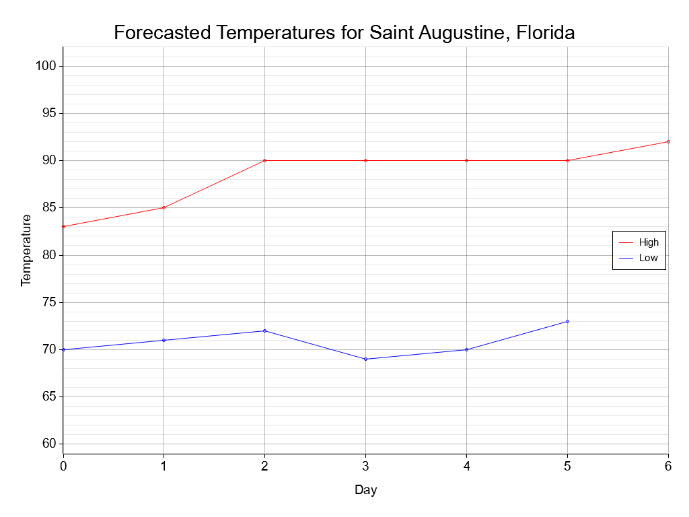

# weather-bot

A discord bot that provides weather information (e.g., METAR, weather forecasts, ultraviolet, etc.) upon request.

## Install

Rename `config-example.json` to `config.json` and edit fields accordingly.

    $ sudo apt install pkg-config libfreetype6-dev libfontconfig1-dev   # required for plotters-rs
    $ git clone https://github.com/smehlhoff/weather-bot.git
    $ cd weather-bot
    $ cargo build --release
    $ nohup ./target/release/weather-bot &

Things to consider...

1. The `user_agent` field must be filled out to retrieve NOAA weather information. You can read more [here](https://www.weather.gov/documentation/services-web-api).
2. For weather alerts, use the Zone Code under Zone List for the `alerts_zone` field for your area. See the zone list [here](https://alerts.weather.gov/).

## Usage

This bot supports the following commands:

    Return current weather                  !wx current <zip code>
    Return weather forecast                 !wx forecast <zip code>
    Return temp forecast in graph format    !wx graph <zip code>
    Return METAR report                     !metar <station code>
    Return TAF report                       !taf <station code>
    Return ATIS information                 !atis <station code>
    Return current UV index                 !uv current <zip code>
    Return UV index forecast                !uv forecast <zip code>
    Return current weather alerts           !alerts <zone code>
    Set default location                    !location set <zip code>
    Return default location                 !location list
    Delete default location                 !location delete
    Return bot uptime                       !uptime
    Return bot logs (admin only)            !logs
    This help menu                          !help

Note: If you set a default location, the following commands do not need a zip code provided:

    !wx current
    !wx forecast
    !wx graph
    !uv current
    !uv forecast

For temp forecast, the bot will generate graphs like below (7-day outlook):

## Contributing

Pull requests are welcome. For major changes, please open an issue first to discuss what you would like to change.

## License

[MIT](https://github.com/smehlhoff/weather-bot/blob/master/LICENSE)